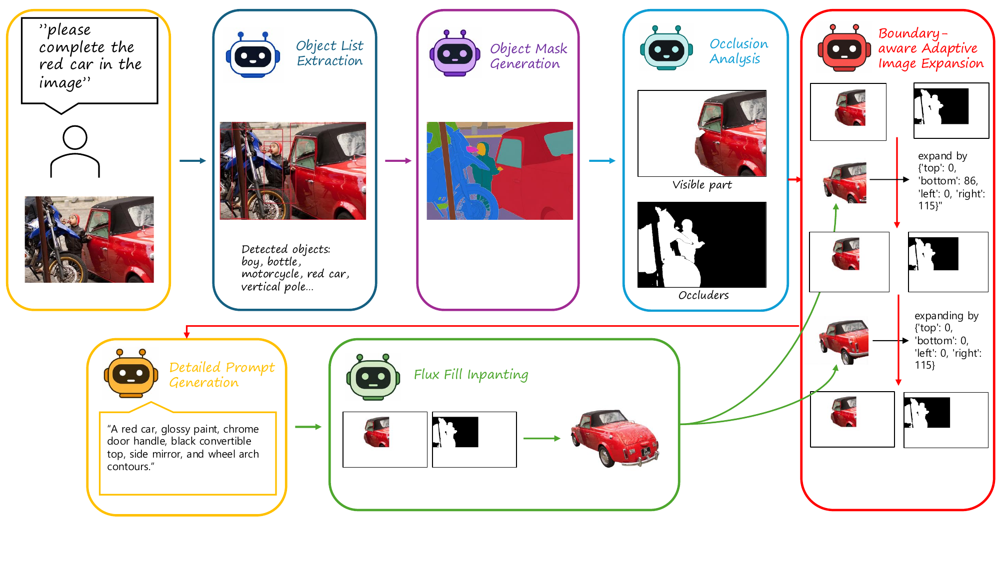
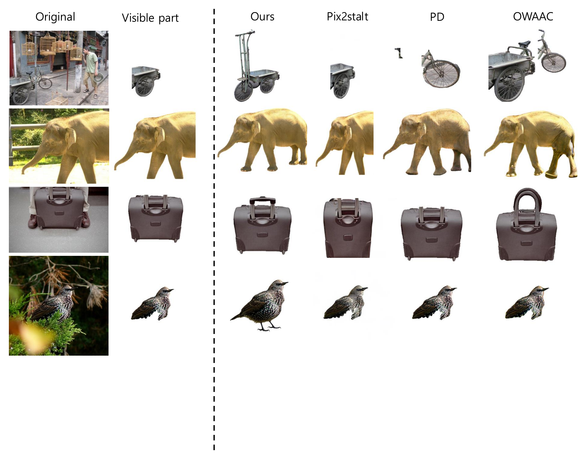

# A Reasoning-Based Amodal Completion Method for Occluded Objects Using Vision-Language Models

> Minsuk Ji, Namhyuk Ahn&dagger;
> To appear in the Journal of KIISE
>
> &dagger; Corresponding author

Existing occluded-object completion methods typically rely on fixed object categories or
pre-trained recognition models, so they fail to detect out-of-distribution objects, and
they expand boundary-truncated regions by a fixed ratio regardless of the object's actual
size or position. Inaccurate masks and plain object-name prompts further degrade
inpainting quality.

This pipeline instead puts a vision-language model (VLM) in the loop at every stage: it
dynamically discovers object candidates instead of relying on a fixed category list,
iteratively judges whether the target is cut off by the image boundary and decides the
expansion direction/amount, and writes an appearance-aware prompt (material, color,
texture) instead of a bare class label to condition inpainting — reducing detection
failures and improving completion quality over fixed-pipeline approaches.



## Method

```
                       ┌─────────────────────────────────────────────────────────────┐
                       │                     input image + instruction                │
                       └───────────────────────────────┬─────────────────────────────┘
                                                         ▼
 1. segmentation/   Sa2VA grounds the target from the instruction → mask;
                     SAMRefiner iteratively refines it with SAM point/box/mask prompts.
                                                         ▼
 2. occlusion/      A VLM lists scene entities; Sa2VA segments each one; InstaOrder
                     predicts pairwise occlusion order to confirm which entities are
                     true occluders of the target → occluder union mask.
                                                         ▼
 3. canvas/         Build the "target-clean" image (target visible, occluded area white).
                     A VLM judges whether the target is truncated by the image border;
                     if so, expand the canvas adaptively toward that direction.
                                                         ▼
 4. planning/       A VLM writes a detailed inpainting prompt (material / color / texture)
                     from the visible parts of the target, instead of a plain class label.
                                                         ▼
 5. inpainting/     FLUX (ControlNet-Inpainting or FLUX.1-Fill) fills the occluder mask
                     union'd with the canvas-expansion region, conditioned on the prompt.
                                                         ▼
 6. verification/   A VLM re-checks whether the target is now fully visible. If not, the
                     canvas is expanded further and inpainting retried (bounded loop).
                                                         ▼
                       ┌─────────────────────────────────────────────────────────────┐
                       │        completed target, cropped on a white background       │
                       └─────────────────────────────────────────────────────────────┘
```

Compared to prior pipelines built on a fixed class list + GroundingDINO/SAM/InstaOrder/LaMa
(e.g. `pd`, OWAAC) or a single diffusion model conditioned only on a visible mask
(pix2gestalt), every reasoning step here — entity discovery, boundary-truncation judgment,
canvas expansion, prompt writing, and final verification — is delegated to a VLM instead of
a fixed heuristic or class list. This lets the pipeline adapt to open-vocabulary objects,
arbitrary occlusion patterns, and objects cut off by the image border, and to iteratively
retry when a single completion pass isn't enough.

## Example result



*Left to right: original image, the visible (unoccluded) part of the target, and the
completed target from this pipeline ("Ours"). The remaining columns show results from
other published methods (Pix2gestalt, PD, OWAAC) on the same inputs, included only as a
qualitative reference — their code is not part of this repository.*

## Repository structure

```
agentic_amodal_completion/
├── main.py                     CLI entry point
├── pipeline.py                 orchestrates the six stages below
├── config.py                   AmodalConfig — all paths/params, env-var overridable
├── types.py                    shared dataclasses (ObjectItem, BoundaryExpansion, ...)
├── common/                     device/GPU, file I/O, low-level mask ops
├── segmentation/                1. target + scene-entity segmentation (Sa2VA, SAMRefiner)
├── occlusion/                   2. occlusion-order reasoning (InstaOrder)
├── canvas/                      3. boundary check + adaptive canvas/mask construction
├── planning/                    4. VLM entity detection + inpainting prompt generation
├── inpainting/                  5. FLUX-based inpainting
└── verification/                6. VLM completion check + retry loop
```

## Setup

```bash
git clone https://github.com/Minsuk-ji/Agentic_Amodal-Completion.git
cd Agentic_Amodal-Completion
python -m venv .venv && source .venv/bin/activate
pip install -r requirements.txt
```

### External model repositories

These are not vendored in this repo — clone them under `external/` (or point the matching
env var at wherever you keep them):

| Dependency | Used by | Default location | Override |
|---|---|---|---|
| [InstaOrder](https://github.com/SNU-VGILab/InstaOrder) + checkpoint | `occlusion/` | `external/InstaOrder` | `AGENTIC_AMODAL_INSTAORDER_DIR`, `AGENTIC_AMODAL_INSTAORDER_CKPT` |
| SAMRefiner + [SAM ViT-H checkpoint](https://github.com/facebookresearch/segment-anything) | `segmentation/sam_refiner.py` | `external/SAMRefiner`, `external/checkpoints/sam_vit_h_4b8939.pth` | `AGENTIC_AMODAL_SAM_REFINER_ROOT`, `AGENTIC_AMODAL_SAM_CKPT` |
| [FLUX-Controlnet-Inpainting](https://github.com/alimama-creative/FLUX-Controlnet-Inpainting) | `inpainting/` (only for `--inpaint_backend controlnet`) | `external/FLUX-Controlnet-Inpainting` | `AGENTIC_AMODAL_FLUX_MODULE_DIR` |

The default inpainting backend, `flux_fill`, needs none of the above — it loads
`black-forest-labs/FLUX.1-Fill-dev` directly from the Hugging Face Hub. Sa2VA
(`ByteDance/Sa2VA-8B`) is also pulled automatically from the Hub on first run.

### Planning VLM

The entity-detection / canvas-expansion / prompt-generation / verification stages call an
OpenAI-compatible chat-completions endpoint. Either:

- **Local**: serve a VLM (e.g. Qwen3-VL) with vLLM and pass `--use_open_llm`:
  ```bash
  vllm serve Qwen/Qwen3-VL-8B-Instruct --host 0.0.0.0 --port 8000 --trust-remote-code
  ```
- **OpenAI API**: omit `--use_open_llm` and set `OPENAI_API_KEY`; requests go to
  `--gpt_model` (default `gpt-4o-mini`) at `api.openai.com`.

## Usage

```bash
python -m agentic_amodal_completion.main \
  --image examples/images/surfboard.jpg \
  --instruction "complete the surfboard in the image" \
  --save_dir results \
  --image_index surfboard_completion \
  --use_open_llm \
  --open_llm_model Qwen/Qwen3-VL-8B-Instruct \
  --open_llm_host 0.0.0.0 --open_llm_port 8000
```

Or run the bundled example end to end:

```bash
bash scripts/run_example.sh
```

Pass `--no_inpaint` to stop after generating the conditioning inputs (target-clean image +
inpaint mask + prompt) without calling FLUX. All intermediate artifacts (masks, canvas
expansion plan, prompt, boundary verification logs) are written to
`<save_dir>/<image_index>/`, alongside a `result.json` summary.

### Key options

| Flag | Meaning |
|---|---|
| `--inpaint_backend {flux_fill,controlnet}` | Inpainting backend (default `flux_fill`) |
| `--default_gpu_id` | CUDA device index for local models |
| `--max_final_boundary_retries` | Max re-expand/re-inpaint retries in the verification loop |
| `--dilation_kernel` / `--dilation_iters` | Occluder mask dilation before inpainting |

Every field in `config.py::AmodalConfig` can also be set via an `AGENTIC_AMODAL_*`
environment variable — see the file for the full list.

### Ablations

`AmodalConfig` exposes four boolean ablation flags (not wired to CLI flags — set them when
constructing `AmodalConfig` in your own script) that swap individual stages for a naive
baseline: `ablation_no_vlm_entity`, `ablation_unidirectional_instaorder`,
`ablation_no_adaptive_canvas`, `ablation_plain_prompt`.

## License

MIT — see [LICENSE](LICENSE).
